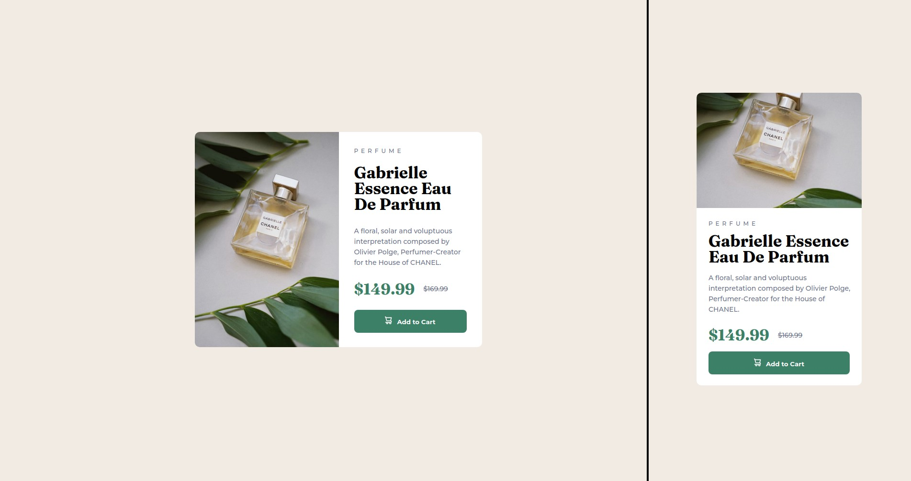

# Frontend Mentor - Product preview card component solution

This is a solution to the [Product preview card component challenge on Frontend Mentor](https://www.frontendmentor.io/challenges/product-preview-card-component-GO7UmttRfa). Frontend Mentor challenges help you improve your coding skills by building realistic projects.

## Table of contents

- [Overview](#overview)
  - [The challenge](#the-challenge)
  - [Screenshot](#screenshot)
  - [Links](#links)
- [My process](#my-process)
  - [Built with](#built-with)
  - [What I learned](#what-i-learned)
  - [Continued development](#continued-development)
  - [Useful resources](#useful-resources)
- [Author](#author)

## Overview

### The challenge

Users should be able to:

- View the optimal layout depending on their device's screen size
- See hover and focus states for interactive elements

### Screenshot



### Links

- Solution URL: [Add solution URL here](https://your-solution-url.com)
- Live Site URL: [Add live site URL here](https://your-live-site-url.com)

## My process

### Built with

- HTML5
- CSS
- Flexbox
- CSS Media Queries

### What I learned

- VSCode command (Emmat: Wrap with Abbreviation) for wrapping selected text in HTML tags quickly. It even has the power to specify classes and inner elements too. It's a handy tool for quickly writing up the HTML.

- Using <picture> tag for creating responsive images.

```html
<picture class="card-image">
  <source
    media="(min-width: 620px)"
    srcset="images/image-product-desktop.jpg"
  />
  <source srcset="images/image-product-mobile.jpg" />
  
</picture>
```

- Basics of CSS media queries

- Began using KRuler to measure pixel distances on screen to help with getting appropriate element sizes and positions so that I don't have to purely eyeball everything. I may try out different tools like this in the future, but this one seems to do the job well enough for now. I found that I started prematurely measuring too often and this slowed things down noticeably. It may be worth eyeballing at the start (especially with positioning) and then aim for near-pixel-perfect positioning & sizes as final touch-ups so that less measurements are required overall.

### Continued development

- Learn more about implementing responsive design (tools, frameworks, details of CSS media query, etc.)
- Learn media query best practices and bad practices
- Begin using Tailwind CSS and/or other frameworks in future challenge solutions, going beyond plain CSS + HTML now that I feel comfortable with the basics.

### Useful resources

- [<picture> Element Sample](https://googlechrome.github.io/samples/picture-element/) - simple example of how <picture> is used and what the result is like
- [Emmet: Wrap with Abbreviation in VSCode example](https://stackoverflow.com/questions/40155875/how-to-do-tag-wrapping-in-vs-code) - Where I learned about Emmet and the command for quickly wrapping text in HTML using an abbreviation.
- [Emmet in VSCode](https://code.visualstudio.com/docs/editor/emmet) - It seems worth learning a few tricks from Emmet. It could help with writing out code faster in all future web projects.
- [KRuler](https://apps.kde.org/en-gb/kruler/) - On-screen ruler for measuring pixels on Linux.

## Author

- Website - [Kostas Kvietinskas](https://www.kostask.com)
- Frontend Mentor - [@KostasKv](https://www.frontendmentor.io/profile/kostaskv)

**Note: Delete this note and add/remove/edit lines above based on what links you'd like to share.**
